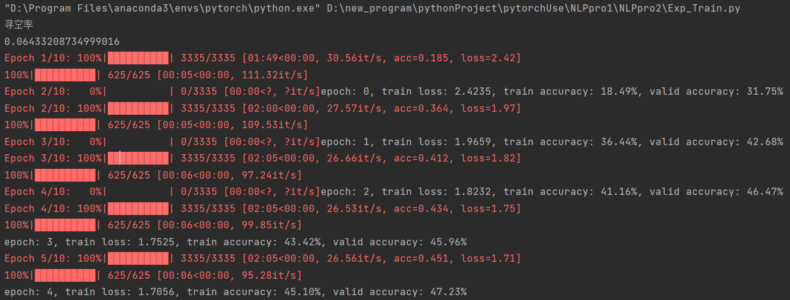

# 第二次实践报告

## 数据集理解

首先我为了搞懂数据集，我打开训练语料，训练语料每一行均为字典形式：

首先是$label.json$列出了15类新闻的label，这意味着分类任务是要将短文本分类为15类。


然后是$train.json$，它的键有：$'label','label\_desc','sentence','keywords'$


然后是$test.json$它的键有：$'id','sentence','keywords'$


另外，$dev.json$键与$train.json$相同，$test1.0.json$的键与$test.json$相同，但是二者的$'keywords'$不为空。


## 模型理解


#### Bi-LSTM

Bi-LSTM是双向长短时记忆网络，一种循环神经网络（RNN）的变体，用于处理序列数据。它包含两个LSTM（长短时记忆网络）层，一个正向层和一个反向层。其架构如下：

```
Input -> Embedding -> Bi-LSTM -> Output
```

- 输入（Input）：输入是一个序列数据，一个序列通常是一句话，在本任务中，序列由新闻中的一个个分词组成，而每个分词通常用一个整数表示。
- 词向量化（Embedding）：输入的整数表示词被词向量化。该层将每个整数映射到一个固定长度的向量，以捕捉单词的语义信息。如果我们不指定weight的话，就随机初始化。
- Bi-LSTM：嵌入向量作为Bi-LSTM的输入。Bi-LSTM通过在正向和反向方向上处理输入序列，来捕捉上下文信息。正向LSTM序列的起始位置开始处理，而反向LSTM从序列的末尾位置开始处理。两个LSTM层的输出被连接起来形成最终的输出。

Bi-LSTM的参数包括嵌入层的权重、LSTM层的权重和偏置。变量的形状变化如下：

- 输入形状：`(batch_size,  sequence_length)`
- 嵌入层输出形状：`(batch_size,  sequence_length,  embedding_dim)`
- Bi-LSTM输出形状：`(batch_size, sequence_length, hidden_size * 2)`


#### Transformer

Transformer是一种基于自注意力机制的模型，用于处理序列数据。它由多个编码器层和多个解码器层组成，用于处理序列到序列的任务。其架构如下：

```
Input -> Embedding -> Encoder -> Decoder Input -> Decoder -> Output
```

在本题中，我们不需要实现序列到序列，只需要实现序列到分类的onehot的任务。因此无需Decoder，只需使用encoder的输出，再用分类器分类。本题中使用的架构为：

```
Input -> Embedding -> Encoder -> classifier -> Output
```

- 编码器（Encoder）：编码器由多个相同的编码器层堆叠而成。每个编码器层包含一个多头自注意力机制和一个前馈神经网络。在自注意力机制中，模型会计算每个位置的表示与其他位置的相关性，并将这些相关性用于加权求和得到每个位置的新表示。前馈神经网络则通过两个全连接层和一个激活函数来处理每个位置的表示。经过多层编码器后，Input的形状保持不变。
- 分类器（classifier）：分类器可以是SVM、感知机、线性分类器、岭回归分类器等等，在本题的项目中，使用一层Linear层作为分类器。

Transformer的参数包括编码器和解码器中的注意力机制的权重、前馈神经网络的权重和偏置。变量的形状变化如下：

- Embedding层：是一个`vocab_size * d_emb`的矩阵。
- 编码器输入和输出形状：`(batch_size, sequence_length, embedding_size)`
- 编码器参数：多头注意力机制的头数`nhead`要能够整除词向量维度`d_emb`

后续利用两个模型的输出可以进行线性分类。


## 任务一：词向量导入

任务一是在Bi-LSMT、Transformer如何调用训练好的word embedding(使用第一次实践作业用的词向量)

任务一的修改主要是在Exp_DataSet.py文件中，在Exp_Model.py和Exp_Train.py中修改部分参数。

#### Embedding层

在Exp_DataSet.py文件中，语料data原本被切分为单字，然后根据出现的先后顺序转化为**整型**。

词向量的使用（以transformer为例）在Exp_Model.py中的如下代码中使用。

```python
self.embed = nn.Embedding(num_embeddings=vocab_size, embedding_dim=d_emb, _weight=embedding_weight)
```

这是transformer的第一层，用于将输入的整型或者是字符串转为embedding。也就是说，将语料的整型转化为d_emb维词向量。

总之，Exp_DataSet.py建立了**词**与**整型**的**映射**，而下载的词向量库是**词**与**词向量**的**映射**，我们接下来要建立的embedding_weight是**整型**与**词向量**的映射。

#### 生成embedding_weight

embedding_weight它是一个二维的矩阵，第一维数字代表输入的整型，第二维是我们的词向量，有300维。为了能生成embedding_weight，在`class Corpos`中，我增加了一个数据和一个方法：

`self.embedding_weight = self.dic2embedding(self.dictionary.tkn2word, emb_path)`

其中，输入`self.dictionary.tkn2word`是词与整型的映射，`emb_path`是词向量字典的本地地址。在增加的方法`self.dic2embedding`中：

```python
    def dic2embedding(self, dictionary, emb_path, WORD_DIM = 300):
        # 从整型到vector构建一个向量表
        # 行数指的是字典word2tkn的数，每个词对应的数，每一行是一个该词对应的词向量
```

首先，导入词向量字典，然后构建空列表embedding_weight，加入**$[pad]:0$**对应的词向量，是**PAD**情况，设置为**零向量**。

```python
word_vectors = KeyedVectors.load_word2vec_format(emb_path)
# print("loading end")
embedding_weight = []
pad_vector = np.zeros(WORD_DIM, dtype=np.float32)
embedding_weight.append(pad_vector)
```

然后，按照整型顺序遍历tkn2word列表，如果词在词向量字典中则append，反之为**UNK**情况，设置为**随机变量**。

```python
for i in range(1, len(dictionary)):
    word = dictionary[i]
    if word in word_vectors:  # 如果是登录词 得到其词向量表示
        vector = word_vectors.get_vector(word)
        vector = vector.astype(np.float32)
    else:  # 如果不是登录词 设置为随机词向量,UNK情况
        vector = np.random.uniform(-0.01, 0.01, WORD_DIM).astype("float32")
        embedding_weight.append(vector)
embedding_weight_torch = torch.tensor(np.array(embedding_weight), 			dtype=torch.float32)
return embedding_weight_torch
```

最后需要将embedding_weight转为张量，需要注意torch中使用`float32`而非`float64`。

另外，在生成词与整型的映射`self.dictionary.tkn2word`时，也需要进行`jieba`中文分词处理，而原本默认的情况是按单字。


#### 分词方式和词向量库的评价

按照上面所述的生成embedding_weight的方法来做，词与词向量的映射非常影响embedding_weight的质量，我统计了UNK率后，来评价分词方式和词向量库的质量。

| 生成词向量方式      | UNK率 |
| ------------------- | ----- |
| jieba+weibo词库     | 0.20  |
| jieba+sogou词库     | 0.14  |
| jieba+financial词库 | 0.21  |
| 单字+weibo词库      | 0.06  |
| 单字+sogou词库      | 0.05  |
| 单字+financial词库  | 0.06  |

综上，单字+sogou新闻词向量库的UNK率较低，这是因为单字总是会总是会含有尽可能多的在词向量库中，所以不进行jieba分词UNK率更低。但是单字不能完全的表示出词语的含义，所以汉语分词很有必要，总和考虑，应该采用jieba+sogou词库的方法。


## 任务二：分类

任务二是利用各模型的隐藏层输出，并送入分类器分类。

#### Transformer

首先我们研究transformer模型，我们需要接着给定代码，在encoder之后加入隐藏层和输出层。我增加的代码如下：

在`init`中:

```python
self.dropout = nn.Dropout(dropout) 
self.fc = nn.Linear(d_emb, num_classes=15)
```

在`forward`中:

```python
x = self.dropout(x)
x, _ = torch.max(x, dim=1) 
x = self.fc(x)
```

基础的超参数如下：

```python
embedding_dim = 300     # 每个词向量的维度
max_token_per_sent = 50 # 每个句子预设的最大 token 数
batch_size = 16
num_epochs = 5
lr = 1e-5
dropout = 0.2
```

分类器设置为线性分类层，隐藏层max_pooling，，学习率1e-5时：


#### BI-LSTM

增加一层分类器：

```python
self.classifier = nn.Linear(ntoken * d_hid * 2, num_classes)
```

线性分类层，sogou词向量库，jieba分词，学习率`lr = 1e-5`


lstm的结构比较适合本项目的较少token情况。

#### 学习率与局部最优和全局最优

transformer的优化我花了很多的时间，在我的尝试中，总是陷入了局部最优。Transformer模型准确率徘徊在10%左右，并且我发现模型趋向于输出同一种标签。我尝试过修改网络结构，比如隐藏层mean_pooling，隐藏层flatten，隐藏层max_pooling等等，都不能起作用。一开始我认为模型准确率徘徊在10%左右是因为transformer参数量大，训练太慢，于是我增加学习率以及增大`epoch`，但是却又没有用。

后来我认识到，这可能是因为模型陷入了局部最优，反而应当减小学习率，我将学习率改为`lr = 1e-5`后终于走出了局部最优，模型的准确率开始突破了10%的魔咒。

#### 其他隐藏层处理方式

1.隐藏层处理有：

flatten法

```python
self.flatten = nn.Flatten()
```

mean pooling法

```python
x = torch.mean(x, dim=1)
```

max pooling法

```python
x, _ = torch.max(x, dim=1)
```

分类器处理有

单层线性层`self.fc = nn.Linear(d_emb, num_classes)`

多层线性层，但是实践发现效果并不好，所以放弃。


#### 其他对比情况

在训练轮数`epoch = 5`的情况下

以基础的超参数如下的情况下，默认分类器设置为线性分类层，隐藏层设置为max_pooling，分词方式为`jieba`分词和`sogou`新闻词向量库。

```python
embedding_dim = 300     # 每个词向量的维度
max_token_per_sent = 50 # 每个句子预设的最大 token 数
batch_size = 16
num_epochs = 5
lr = 1e-5
dropout = 0.2
```

###### 对transformer模型进行修改

修改分词方式为单字未分词+`sogou`新闻词：



在修改分词方式为单字未分词+`sogou`新闻词基础上，设置dropout=0.02


修改隐藏层为`mean_pooling`，结果如下：


修改隐藏层为`flatten`，结果如下：


###### 修改lstm模型

修改lr=1e-4


| 模型        | 模型的超参数和结构修改       | 测试集准确率 |
| ----------- | ---------------------------- | ------------ |
| transformer | 原始                         | 52.08%       |
| transformer | 分词方式为单字               | 47.23%       |
| transformer | 分词方式为单字且dropout=0.02 | 47.69%       |
| transformer | 隐藏层mean_pooling           | 54.02%       |
| transformer | 隐藏层flatten                | 52.74%       |
| lstm        | 原始                         | 50.06%       |
| lstm        | 学习率1e-4                   | 52.08%       |

对transformer，最优配置为隐藏层mean_pooling。其他配置参考上文。而分词方式证明jieba分词更优。

对于lstm，学习率可以比transformer更大，这样训练速度会更快。


### 任务三：预训练模型BERT

任务三：如何在Transformer中使用预训练参数或直接调用预训练模型，完全调用完整的预训练模型，抛弃原始Transformer架构，或者是不改变给定的Transformer架构(如层数)，只迁移参数。

我采用了用bert代替transformer中的encoder的方式。

#### 数据集处理

需要将句子转化为bert的token，需要导入bert的token转化器如下：

```python
from transformers import BertTokenizer
tokenizer = BertTokenizer.from_pretrained('../bert-base-chinese')
```

BERT的token转化器转化出的词向量共友三个：而且以字典形式存储，所以我建立了一个新的数据类`Data`，如下：

```python
class Data(torch.utils.data.Dataset):
    def __init__(self, path, max_token_per_sent, test_mode=False):
        self.dictionary = Dictionary('../tnews/')
        self.max_token_per_sent = max_token_per_sent
        self.texts, self.labels = self.tokenize(path, test_mode)
```

关键的类方法就是`self.tokenize`我将代码中加入注释，呈现如下：

```python
    def tokenize(self, path, test_mode=False):
        sentences = []
        labels = []
        with open(path, 'r', encoding='utf8') as f:
            for line in f:
                one_data = json.loads(line)  # 读取一条数据
                sent = one_data['sentence']
                sentences.append(sent)  # 将原句存储在列表sentences中
                if test_mode:
                    label = json.loads(line)['id']
                    labels.append(label) # 测试集无标签，在 label 中存测试数据的 id
                else:
                    label = json.loads(line)['label']
                    labels.append(self.dictionary.label2idx[label])
        idss = [tokenizer(text,
                        padding='max_length',
                        max_length = self.max_token_per_sent,
                        truncation=True,  # 所有句子都被截断或填充到相同的长度
                        return_tensors="pt")  # 返回PyTorch张量
               for text in sentences]
        return idss, labels
```

最后生成出的idss为：


最终在train文件中也对数据集的生成作出修改，利用`Data`类，如下生成数据集：

```python
    traindata, validata, testdata = Data(train_path, max_token_per_sent), \
                                   Data(valid_path, max_token_per_sent), \
                                   Data(test_path, max_token_per_sent, True)
```


#### 修改模型架构

transformer模型中，我直接使用bert预训练模型来代替原有的编码器部分。bert预训练模型在huhhingface中的([bert-base-chinese at main](https://huggingface.co/bert-base-chinese/tree/main))获取。

```python
class Transformer_model(nn.Module):
    def __init__(self, d_emb=768, dropout=0.1, num_classes = 15):
        super(Transformer_model, self).__init__()
        self.bert = BertModel.from_pretrained('../bert-base-chinese')
        self.dropout = nn.Dropout(dropout)  
        self.fc = nn.Linear(d_emb, num_classes)
        self.relu = nn.ReLU()
    def forward(self ,input_id, mask):
        _, pooled_output = self.bert(input_ids=input_id, 
                                     attention_mask=mask, 
                                     return_dict=False)
        # 注意我们取用bert模型输出的第二个,也即[CLS]来用于后续分类
        x = self.dropout(pooled_output) # 生成维度：(1，batch, d_emb)
        x = self.fc(x)
        x = self.relu(x)
        return x
```

模型经过`self.bert`输出变量维度为：`(1，batch, d_emb)`，已经不存在`seq_len`维度，所以不再需要隐藏层池化，可以直接加入`d_emb->num_classes`的线性`Linear`分类器。

#### 修改train文件

BERT模型的输入需要mask，以测试为例：

```python
        for data in tqdm(data_loader_valid, dynamic_ncols=True):
            batch_x, batch_y = data[0].to(device), data[1].to(device)
            batch_y = batch_y.long() # 原本数据处理时label为int类型，因此改为long用于后续
            mask = batch_x['attention_mask'].to(device)   # mask(不过本项目无需mask)
            input_id = batch_x['input_ids'].squeeze(1).to(device) # 词向量
            output = model(input_id, mask)  # 同时输入词向量和attention mask
            # 取分类概率最大的类别作为预测的类别
            y_hat = torch.tensor([torch.argmax(_) for _ in output]).to(device)
            total_true.append(torch.sum(y_hat == batch_y).item())
```

模型`model`需要同时输入两个变量，词向量和attention mask。


#### 训练结果

训练超参数设置：

```
embedding_dim = 768     # BERT词向量输入维度为768
max_token_per_sent = 40 # 每个句子预设的最大 token 数
batch_size = 2
num_epochs = 5
lr = 1e-6
dropout = 0.1
```

最终训练的结果为：


经过5轮训练，训练集准确率达到了`64.10%`，测试集准确率达到了`56.13%`，而且`loss`还呈下降趋势，`train acc`和`test acc`还呈上升趋势，如果继续训练多个`epoch`，模型的准确率将会更高。预训练模型准确率高于前面的所有模型。


预训练是在大规模未标记的文本数据上通过自监督学习的方式进行训练。预训练可以学习文本数据中的语言模式和语义信息，以便在下游任务中进行迁移学习。BERT预训练目标有两个：掩码语言模型（Masked Language Model，MLM）和下一句预测（Next Sentence Prediction，NSP）。

- MLM任务：在输入序列中随机掩码一些单词，模型需要预测这些掩码单词的正确标签，帮助模型学习单词之间的上下文关系和语义信息。
- NSP任务：给定两个句子，模型需要判断这两个句子是否是连续的，帮助模型学习句子之间的关系和语义信息。[CLS]的训练只能通过这个任务，[CLS]可以用于本项目的文本分类。

模型训练的目的是让两个任务的损失函数最小化。BERT的架构由多个Transformer编码器层组成，包括一个输入嵌入层、多个编码器层和一些额外的任务特定层用于下游任务微调。使用实践作业一中的词向量库就相当于BERT预训练中的学习输入嵌入层。模型微调是指将预训练模型应用于具体任务，并在带标签的数据上进行有监督的训练，也即任务三。


